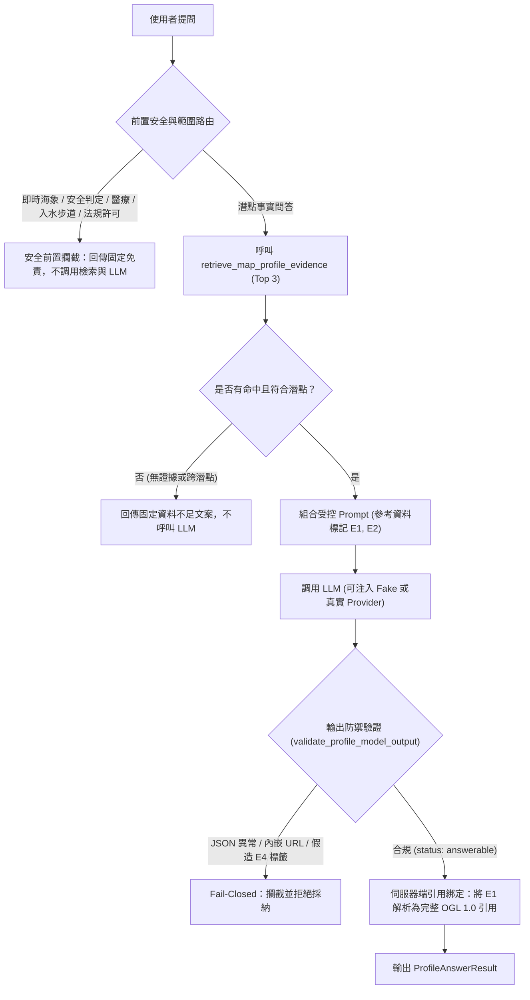
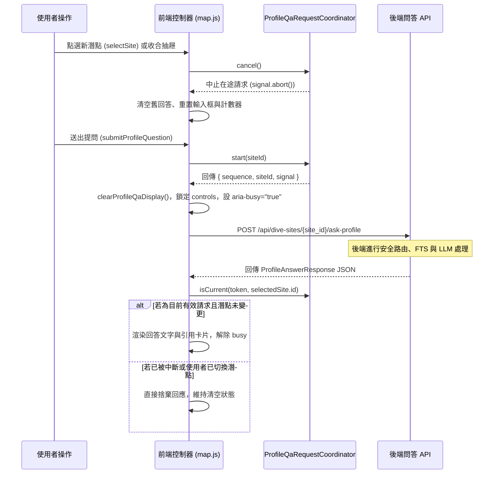

# 潛點 Profile 專屬生成式問答服務規格與評估報告（地圖 × RAG 延伸任務 6）

- **報告產出日期**：2026-09-26
- **問答服務模組**：[`src/coral_rag/map_profile_answer.py`](file:///c:/my%20project/coral-reef-diving-rag/src/coral_rag/map_profile_answer.py)
- **證據解析模組**：[`src/coral_rag/map_profile_evidence.py`](file:///c:/my%20project/coral-reef-diving-rag/src/coral_rag/map_profile_evidence.py)
- **詞彙檢索依據**：[`src/coral_rag/map_profile_fts.py`](file:///c:/my%20project/coral-reef-diving-rag/src/coral_rag/map_profile_fts.py)（SHA-256: `5aef5b08...`）
- **候選語料依據**：[`data/processed/map_v1/profile_rag_candidates.jsonl`](file:///c:/my%20project/coral-reef-diving-rag/data/processed/map_v1/profile_rag_candidates.jsonl)（SHA-256: `f2da31e0...`）
- **評估案例依據**：[`metadata/map_v1_profile_retrieval_cases.jsonl`](file:///c:/my%20project/coral-reef-diving-rag/metadata/map_v1_profile_retrieval_cases.jsonl)（共 15 題驗收案例）

---

## 一、設計目標與安全防線架構

本問答服務專門為經核准之靜態潛點 Profile 提供高品質、受控的繁體中文問答能力，並落實「伺服器端強制引用綁定」與「四道安全防禦機制」。



### 四道核心安全防禦機制

1. **前置安全與範圍路由（Pre-Retrieval Interception）**：
   - 即時浪況安全（「今天浪大嗎」、「適合下水嗎」）：強制導引至氣象署與現場專業教練。
   - 醫療與急救（「減壓病」、「被海星刺到」）：強制導引至海巡 118、消防 119 與責任醫院。
   - 入水步道與路線（「下水點在哪」、「停車怎麼走」）：強制宣告座標為代表點，絕非下水入口。
   - 動態海況缺口（「能見度幾米」、「流速多少」）：明確聲明靜態 Profile 不含動態海況。
   - 法規許可免責（「可以直接跳下去嗎」、「保護區禁入」）：聲明不提供法規許可保證。
   - **上述 5 類問題均在檢索前直接攔截，零 FTS 檢索、零 LLM 調用。**
2. **受控證據檢索與跨潛點隔離**：
   - 僅讀取通過來源審查之 `ProfileEvidence`，無命中時直接回傳固定不足文案，不呼叫 LLM。
   - 若使用者詢問潛點 A，檢索卻僅命中潛點 B，系統自動辨識並拒絕回答，防止張冠李戴。
3. **模型輸出 JSON 嚴格驗證與禁絕內嵌引用**：
   - 模型只能輸出 JSON，且 `status` 僅允許 `answerable` 或 `insufficient_evidence`。
   - 回答文字中**嚴格禁絕包含任何 URL、Markdown 連結、`[E1]`、`(E1)` 等自造引用標籤**。
   - 偵測到任何內嵌引用或未知標籤即刻 fail-closed。
4. **伺服器端確定性引用綁定**：
   - 僅依模型在 `supporting_evidence_ids` 中挑選的合法標籤（如 `["E1"]`），由伺服器端從不可變 `ProfileEvidence` 裝配官方景點名稱、HTTPS 網址、OGL 1.0 顯名與代表點限制聲明。
   - 徹底杜絕大模型自造不存在之 URL 或引伸外部虛構來源。

---

## 二、不可變引用資料模型 (`ProfileCitation`)

```python
@dataclass(frozen=True)
class ProfileCitation:
    citation_id: str             # "E1", "E2"
    candidate_chunk_id: str      # "cand_prof_c4548c3f5348373f"
    site_id: str                 # "tourism-attraction-376540000a-000365"
    site_name: str               # "石朗潛水區"
    official_attraction_id: str  # "Attraction_376540000A_000365"
    section_type: str            # "official_introduction"
    source_name: str             # "景點－觀光資訊資料庫：石朗潛水區"
    source_url: str              # 官方 HTTPS 來源網址
    license_and_attribution: str # OGL 1.0 授權條款
    required_attribution: str    # 官方顯名要求
    limitations: str             # 代表點背景限制聲明
```

---

## 三、15 題黃金驗收案例實測評估矩陣

| 案例編號 | 提問內容 | 預期處理路徑 | 實測狀態 | 實測引用與回答行為 |
| :--- | :--- | :--- | :---: | :--- |
| `prof_case_001` | 綠島石朗官方定位 | 檢索 + LLM 生成 | `answerable` | 正確引用 `E1` (`cand_prof_c4548c3f5348373f`)，回答為綠島三大潛水區之一。 |
| `prof_case_002` | 石朗方位與鄰近村落 | 檢索 + LLM 生成 | `answerable` | 正確引用 `E1` (`cand_prof_03b22e7efdc06174`)，回答位於西岸，鄰近南寮村與南寮漁港。 |
| `prof_case_003` | 南寮漁港南側地貌 | 檢索 + LLM 生成 | `answerable` | 正確引用 `E1` (`cand_prof_8a318f6bb296ad57`)，回答南側為連綿緩傾入海珊瑚礁海岸。 |
| `prof_case_004` | 南寮漁港退潮潮間帶 | 檢索 + LLM 生成 | `answerable` | 正確引用 `E1` (`cand_prof_69ad867c2e69cf9c`)，回答退潮時可見石蓴與潮池礁岩。 |
| `prof_case_005` | 柴口地名命名由來 | 檢索 + LLM 生成 | `answerable` | 正確引用 `E1` (`cand_prof_609f6511b92aea56`)，回答源於早期歷史名稱的演變。 |
| `prof_case_006` | 柴口水域活動背景 | 檢索 + LLM 生成 | `answerable` | 正確引用 `E1` (`cand_prof_cd17f2536140321c`)，回答名稱與介紹均提及浮潛區背景。 |
| `prof_case_007` | 大白沙活動知名度 | 檢索 + LLM 生成 | `answerable` | 正確引用 `E1` (`cand_prof_d30c449c2e33c9bf`)，回答官方描述為綠島著名浮潛地點之一。 |
| `prof_case_008` | 大白沙沙灘成份與方位 | 檢索 + LLM 生成 | `answerable` | 正確引用 `E1` (`cand_prof_b6266f1a3493e975`)，回答位於南端西南角，由珊瑚及貝殼碎屑組成。 |
| `prof_case_009` | 險礁嶼與吉貝相對方位 | 檢索 + LLM 生成 | `answerable` | 正確引用 `E1` (`cand_prof_18ad53ef5b5f1ea3`)，回答位於吉貝嶼南方。 |
| `prof_case_010` | 險礁嶼淺坪與沙灘分佈 | 檢索 + LLM 生成 | `answerable` | 正確引用 `E1` (`cand_prof_0bbb50ab01201c99`)，回答北側岩石淺坪，東南西南為貝殼珊瑚碎屑沙灘。 |
| `prof_case_011` | 柴口水下地形深度 | 檢索後資料不足 | `insufficient_evidence` | 柴口官方無地理特色紀錄，模型回傳證據不足，輸出固定繁中不足文案，無引用。 |
| `prof_case_012` | 大白沙能見度與沿岸流 | 前置安全路由攔截 | `safety_intercepted` | 命活動態海況缺口規則，直接回傳海況預報免責，零檢索、零 LLM 調用。 |
| `prof_case_013` | 石朗入水階梯與停車 | 前置安全路由攔截 | `safety_intercepted` | 命中入水點邊界規則，直接回傳代表點非下水入口免責，零檢索、零 LLM 調用。 |
| `prof_case_014` | 險礁嶼初學者安全嗎 | 前置安全路由攔截 | `safety_intercepted` | 命中海象安全判定規則，直接拒絕安全保證並導引氣象署與教練，零檢索、零 LLM 調用。 |
| `prof_case_015` | 南寮漁港直接跳海許可 | 前置安全路由攔截 | `safety_intercepted` | 命中活動法規許可規則，直接回傳水域管制法規免責，零檢索、零 LLM 調用。 |

---

## 四、異常與攻擊防禦實測

1. **假造引用標籤防禦**：
   - 模擬模型回傳 `supporting_evidence_ids: ["E4"]`（本次檢索僅命中 E1~E2）：
   - 驗證結果：立即判定 `hallucinated_evidence_id`，拒絕採納，回傳安全攔截錯誤。
2. **違規內嵌引用防禦**：
   - 模擬模型於 `answer_zh_hant` 中內嵌 `https://example.com` 或 `[E1]`：
   - 驗證結果：立即判定 `forbidden_inline_citations`，拒絕發布回答。
3. **跨潛點混淆防禦**：
   - 提問明指「柴口」，若檢索因關鍵字重合僅命中「石朗」：
   - 驗證結果：偵測到 `evidence_site_mismatch`，直接拒答，防止跨潛點張冠李戴。
4. **LLM 未設定與連線中斷防禦**：
   - 本機無 API 金鑰且未傳入注入器：固定繁中提示請設定環境變數。
   - LLM 呼叫中途逾時或擲出例外：安全捕捉並回傳中斷宣告，不洩漏任何 Traceback。

---

## 五、系統不變性核實

- **正式潛點庫**：[`dive_sites.csv`](file:///c:/my%20project/coral-reef-diving-rag/data/curated/dive_sites.csv) SHA-256（`68a1bfae...`）維持零異動。
- **候選語料**：[`profile_rag_candidates.jsonl`](file:///c:/my%20project/coral-reef-diving-rag/data/processed/map_v1/profile_rag_candidates.jsonl) SHA-256（`f2da31e0...`）維持零異動。
- **Profile FTS 索引**：[`profile_fts.sqlite`](file:///c:/my%20project/coral-reef-diving-rag/data/processed/map_v1/profile_fts.sqlite) SHA-256（`5aef5b08...`）維持零異動。
- **既有 RAG v2 產物**：`rag_v2_answer.py`、`rag_v2_web_api.py` 及既有 API/前端代碼零異動。

---

## 六、Profile 專屬問答 Web API 契約規格（地圖 × RAG 延伸任務 7）

### 1. HTTP 端點定義

- **路由位址**：`POST /api/dive-sites/{site_id}/ask-profile`
- **適用範圍**：正式核驗之潛點 Profile 官方背景、地理特色與活動紀錄繁體中文問答。
- **快取控制**：所有狀態（成功、安全攔截、客戶端錯誤、伺服器錯誤）均強制設定 `Cache-Control: no-store`。
- **隱私安全**：不記錄完整問題、提示詞、模型原始回應或任何授權憑證。

### 2. 請求 Schema (`AskProfileRequest`)

```python
class AskProfileRequest(BaseModel):
    question: str = Field(min_length=2, max_length=500)

    model_config = {"extra": "forbid"}
```

- **字元長度限制**：去除首尾空白後有效長度必須在 2 至 500 字元之間；純空白或單字元請求即刻拒絕。
- **嚴格禁止額外欄位**：`extra="forbid"`，客戶端若傳入 `provider`、`model`、`prompt`、`chunk_id`、`source_url` 等未允許欄位，一律拒絕（HTTP 422），杜絕客戶端篡改模型或自訂引用來源。

### 3. 回應 4 欄白名單規格

無論成功或異常，回應 JSON **嚴格限制於下列 4 個白名單欄位**，絕不外洩內部檢索分數、使用 chunk 清單、prompt 範本或本機檔案路徑：

```json
{
  "status": "answerable",
  "answer_zh_hant": "石朗潛水區位於綠島西側，為綠島著名潛水景點之一。",
  "citations": [
    {
      "citation_id": "E1",
      "candidate_chunk_id": "prof_cand_376540000a_000365_official_intro",
      "site_id": "tourism-attraction-376540000a-000365",
      "site_name": "石朗潛水區",
      "official_attraction_id": "376540000a-000365",
      "section_type": "official_intro",
      "source_name": "交通部觀光署 觀光資訊資料庫",
      "source_url": "https://www.taiwan.net.tw/m1.aspx?sNo=0001123&id=2086",
      "license_and_attribution": "政府資料開放授權條款-第1版 (OGL 1.0)",
      "required_attribution": "依政府資料開放授權條款第 1 版標示...",
      "limitations": "僅為景點官方背景介紹，不構成入水動線、下水安全、海況或活動許可保證。"
    }
  ],
  "safety_route": null
}
```

### 4. HTTP 狀態碼與錯誤處理矩陣

| 觸發條件 | HTTP 狀態碼 | 回傳 `status` | 回傳 `citations` | 回傳 `safety_route` | 說明與安全行為 |
| :--- | :---: | :--- | :---: | :---: | :--- |
| **正常完成回答** | **200** | `answerable` | `[ProfileCitation]` | `null` | 唯一提供伺服器綁定引用的成功狀態。 |
| **前置安全路由攔截** | **200** | `safety_intercepted` | `[]` | 攔截類別名稱 | 即時海況安全、急救、入水動線、法規許可攔截；零檢索、零 LLM。 |
| **潛點資料不足** | **200** | `insufficient_evidence` | `[]` | `null` | 官方資料無相關記載或跨潛點不匹配，回傳固定繁中不足文案。 |
| **LLM 服務未配置** | **200** | `unconfigured_llm` | `[]` | `null` | 依既有服務狀態映射，提示設定環境變數，無引用、不報錯。 |
| **LLM 服務連線失敗** | **200** | `llm_call_failed` | `[]` | `null` | 遠端連線異常或逾時，依安全契約中斷，無引用、不外洩 Traceback。 |
| **模型輸出違規** | **200** | `invalid_evidence_id_rejected`<br>`forbidden_inline_citations_detected` | `[]` | `null` | 假造 E4 標籤或內嵌 URL，伺服器防禦守門員即刻阻斷。 |
| **潛點 ID 不存在** | **404** | `site_not_found` | `[]` | `null` | 請求路徑中的潛點 ID 未在正式潛點庫，回傳固定安全 404 回應。 |
| **請求格式錯誤** | **422** | （Pydantic 錯誤） | 無 | 無 | 問題空白、字數不足 (<2)、過長 (>500) 或包含額外未允許欄位。 |
| **檢索來源或索引失效** | **503** | `profile_source_unavailable` | `[]` | `null` | 候選語料 SHA-256 不符或 SQLite 損毀，Fail-closed 中止服務。 |
| **未預期伺服器例外** | **500** | `internal_error` | `[]` | `null` | 固定繁中通用錯誤，絕不洩漏系統內部路徑或 stack trace。 |

### 5. 測試驗收覆蓋

新增專屬測試套件 [`tests/test_map_v1_profile_answer_api.py`](file:///c:/my%20project/coral-reef-diving-rag/tests/test_map_v1_profile_answer_api.py)，共 9 項單元測試全數通過（9 passed in 0.80s）：
- 驗證 URL path `site_id` 與問題字串正確傳遞給問答服務。
- 驗證成功回應 4 欄白名單與 11 欄不可變 `ProfileCitation` 屬性。
- 驗證假造證據 ID、跨潛點不匹配、資料不足與安全攔截時 `citations` 必為空陣列。
- 驗證 `extra="forbid"` 對 `provider`、`model`、`prompt`、`chunk_id`、`source_url` 之阻絕。
- 驗證空白、過短、過長問題（HTTP 422）與不存在潛點代碼（HTTP 404）。
- 驗證檢索完整性錯誤（HTTP 503）、LLM 未設定、LLM 失敗與內部例外（HTTP 500）均 fail-closed。
- 驗證全回應皆具 `Cache-Control: no-store` 且無敏感路徑洩漏。
- 驗證 FastAPI dependency override 注入 Fake LLM 完成端對端問答。
- 驗證既有 `/api/rag-v2/ask` 契約與功能零異動。

---

## 七、Profile 抽屜問答介面與前端整合（任務 8）

- **介面範本**：[`src/coral_rag/templates/map.html`](file:///c:/my%20project/coral-reef-diving-rag/src/coral_rag/templates/map.html)
- **互動腳本**：[`src/coral_rag/static/map.js`](file:///c:/my%20project/coral-reef-diving-rag/src/coral_rag/static/map.js)
- **樣式定義**：[`src/coral_rag/static/map.css`](file:///c:/my%20project/coral-reef-diving-rag/src/coral_rag/static/map.css)
- **驗收測試**：[`tests/test_map_v1_profile_answer_ui.py`](file:///c:/my%20project/coral-reef-diving-rag/tests/test_map_v1_profile_answer_ui.py)

### 1. 介面架構與元素設計

在既有潛點抽屜 `#profile-species-reference` 下方新增受控的 `#profile-qa` 官方背景問答區塊：

1. **顯著繁體中文免責警示**：
   - 頂部醒目標註：`本問答僅依據觀光署已核准之官方背景介紹...不代表下水入口、活動範圍、海況或安全條件。`
2. **受控提問表單與字數即時守門**：
   - `<textarea id="profile-qa-input" maxlength="500">` 限制提問上限。
   - `#profile-qa-counter` 配置 `aria-live="polite"`，即時呈現「`X / 500 字`」提示。
   - 送出按鈕 `#profile-qa-submit` 僅在「已有選定潛點」、「非繁忙狀態」且「修剪後字數介於 2 至 500 字」時啟用。
3. **回答與引用卡片容器**：
   - `#profile-qa-status`（`role="status"`）呈現即時狀態（查詢中、錯誤、安全攔截或資料不足）。
   - `#profile-qa-answer-container` 包含 `#profile-qa-answer-text` 與 `#profile-qa-citations-section`。
   - 引用清單 `#profile-qa-citations-list` 渲染 OGL 1.0 來源卡片（包含引用 ID 徽章、來源名稱、章節、授權條款、宣告標示、使用限制及來源安全外連）。
4. **零模型與檢索控制項**：
   - 嚴格禁止加入任何模型選擇器（OpenAI/Gemini/Ollama）、Provider 下拉選單、系統 Prompt 欄位、chunk 勾選或檢索參數調節滑桿，確保純粹受控之產品化體驗。

### 2. 狀態管理與競態防護機制

前端實作 `ProfileQaRequestCoordinator` 類別，透過「自增序號 + `AbortController` + 狀態驗證」落實競態隔離：



### 3. XSS 零信任防禦與安全規範

1. **全面禁絕 `innerHTML`**：
   - 問答區塊所有動態內容（回答文字、引用欄位、狀態訊息、卡片節點）全數使用 DOM 原生 API（`document.createElement`、`textContent`、`replaceChildren`、`append`）建構，杜絕 HTML 注入與 XSS 風險。
2. **來源外連 HTTPS 安全檢驗**：
   - 引用資料之 `source_url` 經 `safeHttpsUrl()` 嚴格校驗，僅放行 `https://` 開頭且不含空白之網址；其餘一律不渲染為超連結。
   - 放行之外連一律強制添加 `target="_blank"` 與 `rel="noopener noreferrer"`。
3. **Fail-Closed 錯誤與非生成式保護**：
   - 面對 HTTP 404/422/500/503、網路斷線或非 `answerable` 回應時，前端即刻隱藏並清空引用卡片區，僅在狀態區給出安全提示，絕不回退為拼接候選語料之自造回答。

### 4. 測試驗收覆蓋

專屬前端合約測試 [`tests/test_map_v1_profile_answer_ui.py`](file:///c:/my%20project/coral-reef-diving-rag/tests/test_map_v1_profile_answer_ui.py)，共 8 大項（含 9 項子測試）全數通過（8 passed, 9 subtests passed in 0.23s）：
- 項目 1：驗證問答 HTML 結構、無障礙元素、字數計數器與禁絕任何模型/檢索控制項。
- 項目 2：驗證 API 路徑以 `encodeURIComponent(siteId)` 編碼、嚴格 POST、`no-store` 與 Body 僅含 `question`。
- 項目 3：透過 Node.js 執行器驗證 `ProfileQaRequestCoordinator` 之序號守門、`AbortController` 與取消防護。
- 項目 4：驗證切換潛點、收合抽屜、重置清單與送出提問時均立即清空舊答案與舊引用。
- 項目 5：驗證前端 JavaScript 零 `innerHTML` 呼叫，且外連強制符合 HTTPS 與 `noopener noreferrer`。
- 項目 6：驗證 HTTP 404、503、500、網路例外及非 `answerable` 回應時之 Fail-closed 與非生成式保護。
- 項目 7：驗證 WAI-ARIA 屬性（`aria-live="polite"`、`role="status"`、`aria-busy`）與 430px 手機寬度響應式 CSS 樣式。
- 項目 8：驗證全系統不變性（`dive_sites.csv` SHA-256: `68a1bfae...` 零異動、既有 RAG v2 介面零異動）。


