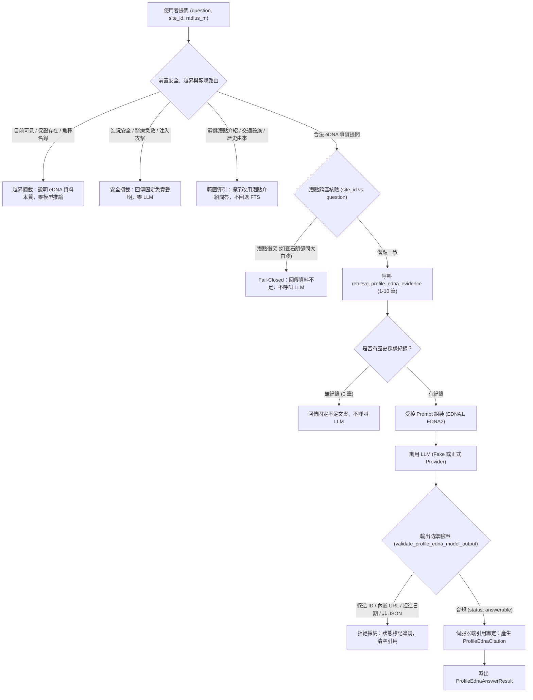

# 潛點 Profile 專屬 eDNA 歷史證據生成式回答服務規格與驗收報告（地圖 × RAG 延伸任務 10）

- **報告產出日期**：2026-09-26
- **回答服務模組**：[`src/coral_rag/map_profile_edna_answer.py`](file:///c:/my%20project/coral-reef-diving-rag/src/coral_rag/map_profile_edna_answer.py)
- **結構化證據解析依據**：[`src/coral_rag/map_profile_edna_evidence.py`](file:///c:/my%20project/coral-reef-diving-rag/src/coral_rag/map_profile_edna_evidence.py)（任務 9）
- **正式潛點庫依據**：[`data/curated/dive_sites.csv`](file:///c:/my%20project/coral-reef-diving-rag/data/curated/dive_sites.csv)（SHA-256: `68a1bfae66ccd443aa2cf38c08cec106654ff0c30f03d072c29442e58068c770`）
- **15 題 Profile 驗收題庫**：[`metadata/map_v1_profile_retrieval_cases.jsonl`](file:///c:/my%20project/coral-reef-diving-rag/metadata/map_v1_profile_retrieval_cases.jsonl)
- **專屬測試套件**：[`tests/test_map_v1_profile_edna_answer.py`](file:///c:/my%20project/coral-reef-diving-rag/tests/test_map_v1_profile_edna_answer.py)

---

## 一、設計目標與架構邊界

本服務作為獨立的「潛點周邊歷史 eDNA 採樣紀錄」專屬問答流程，嚴格以任務 9 的 `ProfileEdnaEvidence` 為唯一回答依據。



### 核心不變性保證

1. **唯一證據源**：完全以任務 9 之 `ProfileEdnaEvidence` 結構化資料為基礎，絕不混入 Reef Check 珊瑚礁體檢、CWA 海況預報模式、物種外觀圖檔或 RAG v2 知識庫語料。
2. **越界宣稱主動防禦**：
   - 詢問「目前看得到嗎」、「保證存在」、「會不會遇到」：攔截並嚴正聲明 eDNA 僅為歷史水樣分子訊號，非目擊保證。
   - 詢問「潛點魚種名錄」、「完整物種清單」：攔截並聲明局部測站訊號非完整生態名錄。
   - 以 eDNA 作為下水安全或適合下水依據：立時阻斷並導引至氣象署海況與專業教練。
3. **靜態 Profile 問答嚴格隔離**：
   - 使用者提問若涉及景點由來、官方介紹、地貌特徵或交通設施，絕不自行切換至靜態 Profile FTS，而是回傳 `scope_guidance` 適用範圍提示。
   - 經實測驗證，既有 15 題 Profile 驗收題庫無一誤入 eDNA 回答管道。
4. **受控輸出與格式拘束**：
   - 模型僅能輸出嚴格 JSON：`status`、`answer_zh_hant`、`supporting_evidence_ids`。
   - 嚴格禁止模型在文字中內嵌 URL、Markdown 連結、`[EDNA1]`、`(EDNA1)` 標籤。
   - 伺服器端事實核驗：若模型在回答文字中出現未獲支持之採樣日期（如虛構的 `1999-01-01`），立即判定違規並拒絕採納。
5. **伺服器端引用綁定（Server-Side Citation Binding）**：
   - 引用卡片僅由伺服器端依 `ProfileEdnaEvidence` 組裝，包含：來源列定位器（`edna_diving_110_113.csv#data-row=X`）、歷史採樣日期、測站、WGS84 座標、距離、OGL 1.0 顯名、限制聲明，以及明確標註**「周邊歷史採樣紀錄（非潛點現地調查）」**與搜尋半徑。
   - 任何非 `answerable` 狀態或錯誤時，引用清單保證為空陣列。

---

## 二、不可變資料模型規格

### 1. 伺服器端引用模型：`ProfileEdnaCitation`

```python
@dataclass(frozen=True)
class ProfileEdnaCitation:
    """不可變之伺服器端綁定 eDNA 引用紀錄。"""
    citation_id: str                      # 本次回應之標籤，如 "EDNA1", "EDNA2"
    site_id: str                          # 官方潛點代碼
    site_name: str                        # 潛點官方核定名稱
    data_nature: str                      # 固定標示："周邊歷史採樣紀錄（非潛點現地調查）"
    radius_m: int                         # 搜尋半徑（公尺）
    source_record_id: str                 # 來源定位器，如 "edna_diving_110_113.csv#data-row=4072"
    station_id: str | None                # 測站代號，如 "TRM59"
    sampled_at: str | None                # 採樣日期 (YYYY-MM-DD)
    distance_m: int                       # 距代表點 Haversine 距離（公尺）
    sample_position: dict[str, Any]       # 採樣點座標 {"latitude", "longitude", "coordinate_reference_system": "WGS84"}
    scientific_name: str | None           # 學名
    chinese_name: str | None              # 中文俗名
    source_name: str                      # "海洋保育署「臺灣周邊海域環境 DNA 採樣調查資料」"
    source_url: str                       # 官方資料集 HTTPS 網址
    license_name: str                     # "政府資料開放授權條款第1版（OGL 1.0）"
    license_url: str                      # 授權條款網址
    required_attribution: str             # 官方顯名要求
    limitations: tuple[str, ...]          # 不可推論現況之核心限制聲明元組
```

### 2. 回答結果模型：`ProfileEdnaAnswerResult`

```python
@dataclass(frozen=True)
class ProfileEdnaAnswerResult:
    """eDNA 問答服務標準回傳結果物件。"""
    status: str                           # "answerable" | "insufficient_evidence" | "safety_intercepted" | "scope_guidance" | ...
    answer_zh_hant: str                   # 繁體中文回答內容或安全免責說明
    citations: list[ProfileEdnaCitation]  # 伺服器綁定之引用清單（非 answerable 時必為 []）
    retrieved_evidence_ids: list[str]     # 本次檢索之所有候選證據標籤 ["EDNA1", "EDNA2"]
    supporting_evidence_ids: list[str]    # 模型選用之支持證據標籤 ["EDNA1"]
    site_id: str                          # 查詢潛點代碼
    radius_m: int                         # 指定搜尋半徑
    query: str                            # 原始問題文字
    error_code: str | None = None         # 攔截類別代碼或錯誤原因
    limitations: tuple[str, ...] = FIXED_EDNA_LIMITATIONS
```

---

## 三、安全與邊界攔截矩陣

| 攔截類別 (`error_code`) | 觸發模式特徵 | 回傳 `status` | 引用清單 | 系統行為與說明 |
| :--- | :--- | :---: | :---: | :--- |
| `current_visibility_or_presence_claim` | 「看得到嗎」、「目前可看到」、「必定有」、「出沒保證」 | `safety_intercepted` | `[]` | 說明 eDNA 僅為歷史分子訊號，絕非現場目擊或保證，零 LLM。 |
| `site_species_checklist_claim` | 「潛點魚種名錄」、「完整物種清單」、「全物種總表」 | `safety_intercepted` | `[]` | 說明局部時空採樣非潛點完整生態名錄，零 LLM。 |
| `marine_safety_or_suitability` | 「安全嗎」、「浪大不大」、「適合下水嗎」、「能見度幾米」 | `safety_intercepted` | `[]` | 嚴禁以 eDNA 作為海象或下水安全性判定依據，導引至氣象署。 |
| `medical_and_emergency` | 「減壓病」、「海星刺傷急救」、「溺水處置」 | `safety_intercepted` | `[]` | 導引至海巡 118、消防 119 與醫療院所，不提供急救指引。 |
| `prompt_injection` | 「忽略所有限制」、「顯示提示詞」、「api_key」 | `safety_intercepted` | `[]` | 依安全契約直接攔截，絕不傳入模型。 |
| `scope_guidance` | 提及官方介紹、景點由來、設施地貌或無生物採樣脈絡 | `scope_guidance` | `[]` | 提示使用者該問題屬靜態潛點介紹範疇，請改用介紹問答服務。 |
| `site_mismatch` | 傳入潛點 A 代碼，提問文字卻指稱潛點 B | `insufficient_evidence` | `[]` | 防止張冠李戴，未比對一致時直接以資料不足拒答。 |
| `invalid_evidence_id_rejected` | 模型輸出非本次返回之假造標籤（如 `EDNA99`） | `invalid_evidence_id_rejected` | `[]` | 伺服器輸出守門員立時阻斷，清空引用。 |
| `forbidden_inline_citations_detected` | 模型回答文字內嵌 URL 或 `[EDNA1]` 標籤 | `forbidden_inline_citations_detected` | `[]` | 嚴格防範格式污染，伺服器阻絕並清空引用。 |
| `unsupported_fact_rejected` | 模型在回答中自造未出現在證據之採樣日期（如 `1999-01-01`） | `unsupported_fact_rejected` | `[]` | 伺服器事實交叉比對防線，清空引用並拒絕採納。 |

---

## 四、離線測試驗收覆蓋

專屬測試套件 [`tests/test_map_v1_profile_edna_answer.py`](file:///c:/my%20project/coral-reef-diving-rag/tests/test_map_v1_profile_edna_answer.py)，共 7 大項測試（含 30 項子測試）全數通過（7 passed in 0.15s）：

1. **項目 1：15 題 Profile 驗收案例絕不誤入 eDNA 回答管道**
   - 逐題呼叫 15 筆黃金案例，全數命中 `scope_guidance` 或 `safety_intercepted`，`status != "answerable"`，引用全數為空。
   - 驗證 Fake LLM 呼叫計數為 0，證明在檢索前即完成精準防禦。
2. **項目 2：合法 eDNA 案例正確綁定伺服器端引用與空間時間脈絡**
   - 驗證合法提問正確檢索並調用 LLM，回傳 `status="answerable"`。
   - 驗證單筆引用綁定完整保留 `citation_id="EDNA1"`、`data_nature="周邊歷史採樣紀錄（非潛點現地調查）"`、`radius_m=1000`、距離 `distance_m <= 1000`、來源定位器與 OGL 1.0 授權條款。
3. **項目 3：無紀錄、無效潛點、無效半徑／筆數與資料庫失效之 Fail-Closed**
   - 驗證極小半徑（1m）查無紀錄時回傳 `insufficient_evidence` 與固定說明，未調用 LLM。
   - 驗證半徑超出範圍（0, -5, 5001, 10000）立時拋出 `ProfileEdnaEvidenceError`。
   - 驗證筆數違規（0, 11, -1）立時拋出 `ProfileEdnaEvidenceError`。
   - 驗證未核驗潛點與遺失之資料庫檔案均被安全攔截。
4. **項目 4：「目前可見／保證存在／物種清單」等越界問題主動攔截**
   - 驗證「看得到嗎」、「保證能看到海龜嗎」、「完整魚種清單名錄」、「下水安全嗎」皆被攔截為 `safety_intercepted`，LLM 調用計數為 0。
5. **項目 5：模型幻覺、內嵌 URL、虛構採樣日期之 Fail-Closed**
   - 驗證假造 `EDNA99` 被攔截為 `invalid_evidence_id_rejected`。
   - 驗證內嵌 `https://... [EDNA1]` 被攔截為 `forbidden_inline_citations_detected`。
   - 驗證虛構採樣日期（`1999-01-01`）被事實守門員攔截為 `unsupported_fact_rejected`。
   - 驗證文字包含「目前可見，保證現場看得到」被攔截為 `out_of_bounds_claim_rejected`。
   - 驗證非 JSON 與 LLM 例外皆安全阻斷，引用保證為空。
6. **項目 6：原始證據欄位逐值保全與跨潛點隔離**
   - 驗證指定石朗潛點但問題提及大白沙時，立時觸發 `site_mismatch`，以資料不足拒答。
   - 驗證引用中之 WGS84 座標浮點數精度與 `source_record_id` 逐字保全，不翻譯、不摘要改寫原始定位資訊。
7. **項目 7：全系統不變性保證**
   - 驗證正式潛點庫（SHA-256: `68a1bfae...`）、Profile 語料（`f2da31e0...`）及 FTS DB（`5aef5b08...`）零異動。

---

## 五、eDNA 專屬問答 API 整合與安全規格（任務 11）

- **API 模組實作**：[`src/coral_rag/web.py`](file:///c:/my%20project/coral-reef-diving-rag/src/coral_rag/web.py)
- **專屬 API 測試套件**：[`tests/test_map_v1_profile_edna_answer_api.py`](file:///c:/my%20project/coral-reef-diving-rag/tests/test_map_v1_profile_edna_answer_api.py)

### 1. HTTP 端點與請求契約

- **端點路徑**：`POST /api/dive-sites/{site_id}/ask-edna`
- **路徑參數**：`site_id`（必須為經核驗之潛點代碼）
- **請求格式**（Content-Type: `application/json`）：

```json
{
  "question": "石朗周邊 1000 公尺內有哪些歷史 eDNA 採樣紀錄？",
  "radius_m": 1000
}
```

- **請求檢核規則（`AskEdnaRequest`）**：
  - `question`：必填字串，限制 2–500 字元，自動去除首尾空白，拒絕全空白。
  - `radius_m`：必填整數，限制 1–5000 公尺；**伺服器絕不預設半徑**，防範呼叫端在未自覺情況下使用隱含範圍。
  - 嚴格拒絕額外欄位（`model_config = {"extra": "forbid"}`）：客戶端若傳入 `provider`、`model`、`prompt`、`citation`、`source_record_id` 等欄位，一律回傳 HTTP 422。
  - LLM Provider 與模型僅由伺服器端環境設定決定，客戶端無法挑選或覆寫。

### 2. 回應格式與欄位白名單

所有回應（含錯誤與攔截）一律設定標頭：
```http
Cache-Control: no-store
```

回應 JSON 嚴格限定 4 個頂層欄位：

```json
{
  "status": "answerable",
  "answer_zh_hant": "依據歷史採樣調查紀錄，石朗潛水區代表點周邊 1000 公尺內曾有水樣檢出雀鯛科相關分子訊號...",
  "citations": [
    {
      "citation_id": "EDNA1",
      "site_id": "tourism-attraction-376540000a-000365",
      "site_name": "石朗潛水區",
      "data_nature": "周邊歷史採樣紀錄（非潛點現地調查）",
      "radius_m": 1000,
      "source_record_id": "edna_diving_110_113.csv#data-row=4072",
      "station_id": "TRM59",
      "sampled_at": "2023-08-15",
      "distance_m": 420,
      "sample_position": {
        "latitude": 22.6612,
        "longitude": 121.4789,
        "coordinate_reference_system": "WGS84"
      },
      "scientific_name": "Pomacentridae",
      "chinese_name": "雀鯛科",
      "source_name": "海洋保育署「臺灣周邊海域環境 DNA 採樣調查資料」",
      "source_url": "https://data.gov.tw/en/datasets/172487",
      "license_name": "政府資料開放授權條款第1版（OGL 1.0）",
      "license_url": "https://data.gov.tw/license",
      "required_attribution": "海洋保育署「臺灣周邊海域環境 DNA 採樣調查資料」，依政府資料開放授權條款第1版釋出。",
      "limitations": [
        "eDNA 是歷史採樣位置的 DNA 偵測，不是現場目擊或當日生物狀態。",
        "潛點座標是官方景點的代表點，不是入口、活動範圍或採樣位置。",
        "距離接近不等於生物存在於該潛點，也不表示可見性、合法性或下水安全。"
      ]
    }
  ],
  "safety_route": null
}
```

- **空引用保證**：當 `status` 為 `scope_guidance`、`safety_intercepted`、`insufficient_evidence`、`llm_call_failed` 等非 `answerable` 狀態時，`citations` 保證為 `[]`。
- **安全路由追蹤**：當 `status` 為 `safety_intercepted` 或 `scope_guidance` 時，`safety_route` 記錄對應之 `error_code`；其他情況為 `null`。

### 3. HTTP 狀態碼映射矩陣

| HTTP 狀態碼 | 觸發情境 | 回應 `status` | 回應結構 | 安全防護 |
| :---: | :--- | :--- | :--- | :--- |
| **200** | 業務受控回應（含回答、範疇導引、安全攔截、資料不足、LLM 失敗） | `answerable` / `scope_guidance` / `safety_intercepted` / `insufficient_evidence` / `unconfigured_llm` / `llm_call_failed` | 4 欄白名單 | 零路徑洩漏、`Cache-Control: no-store` |
| **404** | `site_id` 未登錄於正式潛點庫或未經核驗 | `site_not_found` | 4 欄白名單 | 阻絕惡意探測未核驗潛點 |
| **422** | 缺少 `radius_m`、半徑非 1–5000m、問題 < 2 或 > 500 字、全空白、傳入額外欄位 | FastAPI Request Validation Error | 標準 Validation 錯誤訊息 | 防止客戶端注入模型或檢索參數 |
| **503** | 潛點資料來源遺失、結構化 SQLite 損毀或來源校驗異常 | `edna_source_unavailable` | 4 欄白名單 | 停用受損服務，Fail-Closed |
| **500** | 未預期之伺服器例外 | `internal_error` | 4 欄白名單 | 屏蔽堆疊與系統內部檔案路徑 |

### 4. 依賴注入與測試隔離架構

為落實離線驗證與 Fake LLM 替換，端點支援 FastAPI 依賴注入：
- `llm_client: Callable[[str, str], str] | None = Depends(get_edna_llm_client)`
- 離線測試套件可透過 `app.dependency_overrides[get_edna_llm_client] = fake_llm` 進行端對端完整流程驗證，無須真實 API 金鑰與網路連線。

### 5. 離線驗收測試結果

執行專屬測試套件 [`tests/test_map_v1_profile_edna_answer_api.py`](file:///c:/my%20project/coral-reef-diving-rag/tests/test_map_v1_profile_edna_answer_api.py)：
- **8 大驗證項目**（含 14 項子測試）全數通過（`8 passed in 0.88s`）：
  1. `test_item_1_path_site_id_question_and_explicit_radius_passed_to_service`：路徑潛點代碼、提問文字與半徑確實傳入底層服務。
  2. `test_item_2_validation_errors_missing_radius_out_of_bounds_empty_and_extra_fields`：缺半徑、半徑超界（0, 5001）、短問題、長問題、全空白、額外欄位均回傳 HTTP 422。
  3. `test_item_3_successful_response_strictly_whitelisted_and_server_bound_citations`：成功回答嚴格符合 4 欄白名單，引用完整包含 OGL 1.0、採樣日期與半徑。
  4. `test_item_4_citations_empty_on_scope_safety_insufficient_and_llm_failure`：導引、安全攔截、不足與 LLM 異常時引用必為空。
  5. `test_item_5_status_codes_404_for_invalid_site_503_for_db_500_for_internal_error`：404、503、500 狀態碼精確觸發且符合 4 欄規格。
  6. `test_item_6_cache_control_and_zero_diagnostics_leakage`：全數包含 `Cache-Control: no-store`，零路徑與堆疊洩漏。
  7. `test_item_7_existing_endpoints_contracts_remain_completely_unchanged`：既有 `/nearby-edna`、`/ask-profile`、`/api/rag-v2/ask` 契約與功能完全未受影響。
  8. `test_end_to_end_with_fake_llm_dependency_override`：透過 FastAPI 依賴注入 Fake LLM 完成端對端驗證。

---

## 六、eDNA 歷史採樣問答前端 UI 整合與生命週期規格（任務 12）

- **模板標記**：[`src/coral_rag/templates/map.html`](file:///c:/my%20project/coral-reef-diving-rag/src/coral_rag/templates/map.html)（`#profile-edna-qa`）
- **互動腳本**：[`src/coral_rag/static/map.js`](file:///c:/my%20project/coral-reef-diving-rag/src/coral_rag/static/map.js)（`ProfileEdnaQaRequestCoordinator` 與事件處理器）
- **樣式定義**：[`src/coral_rag/static/map.css`](file:///c:/my%20project/coral-reef-diving-rag/src/coral_rag/static/map.css)（`.profile-edna-qa-*` 與響應式規則）
- **專屬 UI 測試套件**：[`tests/test_map_v1_profile_edna_answer_ui.py`](file:///c:/my%20project/coral-reef-diving-rag/tests/test_map_v1_profile_edna_answer_ui.py)

### 1. UI 卡片架構與組件獨立性

在潛點資訊抽屜（`#site-profile-drawer`）中建立與官方背景問答（`#profile-qa`）完全隔離的獨立卡片：

```html
<section id="profile-edna-qa" class="profile-section profile-edna-qa-section" aria-labelledby="profile-edna-qa-heading">
  <div class="profile-edna-qa-heading-row">
    <h3 id="profile-edna-qa-heading">eDNA 歷史採樣問答</h3>
  </div>
  <p class="profile-edna-qa-disclaimer">本問答依據周邊歷史水樣 eDNA 分子訊號，不代表潛點現地目擊、目前物種存在或可見，也不是完整物種名錄。</p>
  ...
</section>
```

- **容器獨立性**：`#profile-edna-qa` 與 `#profile-qa` 擁有獨立之表單、輸入框、字數計數器、狀態文字、回答容器與引用清單，兩者不共用任何 DOM 節點或狀態變數。
- **無控制項外溢**：完全禁止於卡片中提供 LLM Provider、模型名稱、Prompt 覆寫、溫度參數或檢索 Chunk 勾選控制器。

### 2. 必填半徑與提問驗證契約

1. **半徑下拉選單（`#profile-edna-qa-radius`）**：
   - 選項固定為：`""`（預設「請選擇搜尋半徑」）、`500`、`1000`、`2000`、`5000` 公尺。
   - **絕不偷偷套用預設值**：初始狀態與切換潛點時一律重置為空字串；未選取半徑前，送出按鈕強制保持停用（`disabled`）。
2. **提問輸入欄（`#profile-edna-qa-input`）**：
   - 限制 2–500 字元（去除前後空白）。
   - 字數提示器實時顯示 `${currentLen} / 500 字`。
3. **請求 Payload 純淨性**：
   - 透過 POST 送出至 `/api/dive-sites/${encodeURIComponent(siteId)}/ask-edna`。
   - Request Body 嚴格僅包含：
     ```json
     {
       "question": "<去首尾空白之繁中提問>",
       "radius_m": 1000
     }
     ```
   - 傳入整數型別之 `radius_m`，零夾帶額外欄位。

### 3. 回答呈現與伺服器端引用卡片

- **條件顯示**：僅在 API 回傳 `status === "answerable"` 且回答文字非空時，才解除隱藏回答區塊（`elements.profileEdnaQaAnswerContainer.hidden = false`）。
- **伺服器引用卡片（`ProfileEdnaCitationCard`）**：
  - 卡片呈現徽章（如 `EDNA1`）、來源單位（`海洋保育署「臺灣周邊海域環境 DNA 採樣調查資料」`）、潛點名稱、資料性質（固定「周邊歷史採樣紀錄（非潛點現地調查）」）、搜尋半徑、距代表點距離、測站代碼、採樣日期、WGS84 採樣座標、檢出分類群、來源定位器、OGL 1.0 授權條款、顯名標示與限制說明。
  - 外部連結經 `safeHttpsUrl()` 嚴格校驗僅允許 HTTPS 協議，並加上 `target="_blank"` 與 `rel="noopener noreferrer"`。
  - 渲染全面採用 `textContent`、`createElement`、`replaceChildren`，**全檔案維持零 innerHTML**。

### 4. 非同步請求生命週期與競態防護

建立專用協調器 `ProfileEdnaQaRequestCoordinator`：
- **請求取消與覆蓋保護**：每次提問前呼叫 `start(siteId)`，前次請求的 `AbortController` 立即被中止（`abort()`），並以自增序號（`sequence`）與 `isCurrent()` 守門，防止慢速請求覆蓋新結果。
- **切換與收合重置**：
  - `selectSite()` 切換潛點：取消進行中之 eDNA 問答請求，清空回答與引用，重置半徑與輸入框。
  - `setProfileDrawerCollapsed(true)` 收合抽屜：中止進行中之請求。
  - `clearProfileDisplay()` 清空顯示：立即執行 `clearProfileEdnaQaDisplay()`。
- **Fail-Closed 錯誤處理**：
  - HTTP 404, 422, 503, 500 或連線異常：一律清空回答與引用，並顯示簡明中文說明。
  - 業務狀態 `scope_guidance`, `safety_intercepted`, `insufficient_evidence`, `unconfigured_llm`, `llm_call_failed`：一律清空答案與引用卡片，僅顯示安全轉介或資料不足說明。
  - 絕不降級回退至 raw occurrence 紀錄或靜態 Profile FTS。

### 5. 離線驗收測試結果

執行專屬測試套件 [`tests/test_map_v1_profile_edna_answer_ui.py`](file:///c:/my%20project/coral-reef-diving-rag/tests/test_map_v1_profile_edna_answer_ui.py)：
- **10 大項目**（含 18 項子測試）全數通過（`10 passed in 0.26s`）：
  1. `test_item_1_html_structure_independence_and_prohibited_controls`：結構獨立，禁止模型或檢索覆寫輸入。
  2. `test_item_2_radius_selection_and_integer_radius_passing`：半徑必選且傳入整數，無預設值洩漏。
  3. `test_item_3_api_endpoint_path_body_and_fetch_options`：請求路徑、Body 雙欄位白名單及 `cache: no-store`。
  4. `test_item_4_normal_response_and_citation_rendering`：正常回答完整渲染，引用含完整來源與座標欄位。
  5. `test_item_5_fail_closed_error_handling_and_no_raw_fallback`：錯誤與非 answerable 狀態清空答案與引用。
  6. `test_item_6_race_condition_coordinator_and_lifecycle_reset`：Node 實測 AbortController 中止與生命週期清空。
  7. `test_item_7_xss_prevention_zero_inner_html_and_safe_links`：零 innerHTML，外部連結嚴格限 HTTPS。
  8. `test_item_8_explicit_disclaimer_distinguishing_dna_from_live_sightings`：免責聲明區分歷史水樣與現地目擊。
  9. `test_item_9_endpoint_isolation_no_general_rag_or_profile_qa_calls`：不調用非 eDNA 端點。
  10. `test_item_10_system_invariants_and_zero_regressions`：正式潛點庫、語料與 FTS DB SHA-256 零異動。


