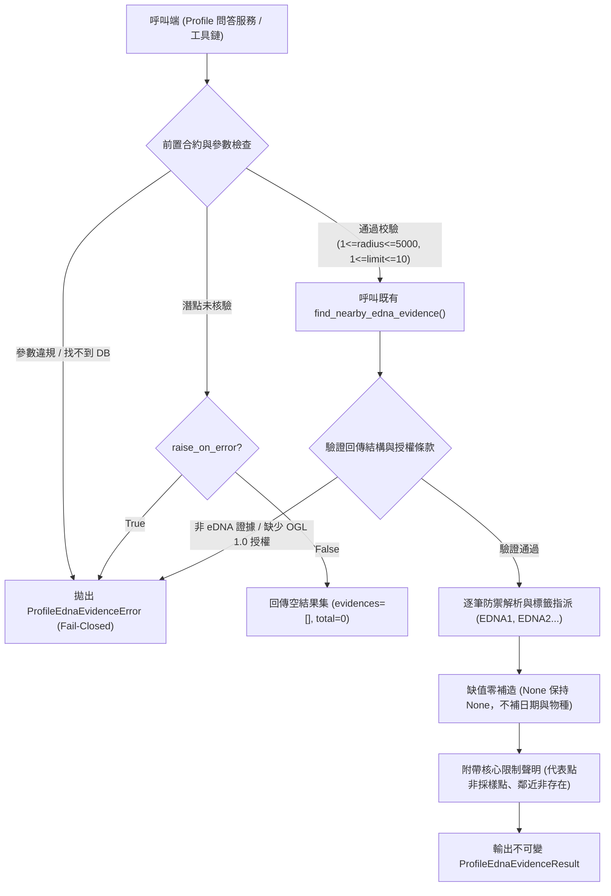

# 潛點 Profile 專屬 eDNA 結構化證據解析器規格與驗收報告（地圖 × RAG 延伸任務 9）

- **報告產出日期**：2026-09-26
- **解析器模組**：[`src/coral_rag/map_profile_edna_evidence.py`](file:///c:/my%20project/coral-reef-diving-rag/src/coral_rag/map_profile_edna_evidence.py)
- **唯讀查詢依據**：[`src/coral_rag/nearby_edna.py`](file:///c:/my%20project/coral-reef-diving-rag/src/coral_rag/nearby_edna.py) 之 `find_nearby_edna_evidence()`
- **結構化資料庫依據**：[`data/runtime/research/marine_research.sqlite`](file:///c:/my%20project/coral-reef-diving-rag/data/runtime/research/marine_research.sqlite)
- **正式潛點庫依據**：[`data/curated/dive_sites.csv`](file:///c:/my%20project/coral-reef-diving-rag/data/curated/dive_sites.csv)（SHA-256: `68a1bfae66ccd443aa2cf38c08cec106654ff0c30f03d072c29442e58068c770`）
- **驗收測試套件**：[`tests/test_map_v1_profile_edna_evidence.py`](file:///c:/my%20project/coral-reef-diving-rag/tests/test_map_v1_profile_edna_evidence.py)

---

## 一、設計目標與架構邊界

本解析器專門為潛點 Profile 問答提供受控的歷史 eDNA 結構化證據提取能力，將空間鄰近之環境 DNA 調查紀錄轉換為具強型別、可追溯且防禦性極高之 `ProfileEdnaEvidence` 物件。



### 核心不變性保證

1. **沿用既有查詢邏輯**：直接呼叫 `find_nearby_edna_evidence()`，絕不重寫 SQL 查詢、Haversine 距離公式或在資料庫中建立新的 site-record 關聯。
2. **潛點白名單強制拘束**：`site_id` 必須存在於正式潛點庫（`data/curated/dive_sites.csv`），未核驗或不存在之潛點一律 fail-closed。
3. **無預設半徑強制明確性**：呼叫端必須明確指定 `radius_m`（1–5000 公尺），系統絕不自行推估或預設搜尋半徑。
4. **上下文長度防禦（筆數上限 1–10）**：單次查詢筆數嚴格限制於 1 至 10 筆，避免將海量物種清單注入未來模型之 Context Window。
5. **嚴格 OGL 1.0 授權驗證**：僅接受 `evidence_type=nearby_historical_edna_evidence`，且具備海洋保育署 OGL 1.0 授權宣告之紀錄。
6. **歷史訊號客觀性（零推論、零補造）**：
   - 原始資料缺少採樣日期、座標或分類名稱時，一律保留為 `None`，絕不以當前時間補日期、絕不臆測分類群、絕不產生「目前可見」或「潛點魚種清單」之敘述。
7. **絕對隔絕非 eDNA 資產**：
   - 絕不讀取或混入 Reef Check 珊瑚礁體檢志工目視資料。
   - 絕不讀取或混入 CWA 數值海況預報模式（`M-B0078-001`）。
   - 絕不讀取或混入物種參考圖檔（`SP-IMG-*`、`CAND-*`）。
   - 絕不讀取或混入 RAG v2 知識庫語料（`chk_*`、`prof_cand_*`）。
8. **零異動保證**：
   - 結構化資料庫、Profile FTS 資料庫、Profile 問答 API、Profile 候選語料及正式潛點 CSV 零異動。
   - 本任務僅提供 eDNA 結構化證據解析，不代表已接入 LLM 回答管道。

---

## 二、不可變資料模型規格

### 1. 單筆證據模型：`ProfileEdnaEvidence`

```python
@dataclass(frozen=True)
class ProfileEdnaEvidence:
    """不可變之伺服器端核驗 eDNA 結構化證據紀錄。"""
    evidence_id: str                      # 本次回應之伺服器端標籤，如 "EDNA1", "EDNA2"
    site_id: str                          # 正式潛點代碼，如 "tourism-attraction-376540000a-000365"
    site_name: str                        # 潛點官方核定名稱，如 "石朗潛水區"
    representative_point: dict[str, Any]  # 潛點代表點座標 {"latitude", "longitude", "coordinate_reference_system": "WGS84"}
    source_record_id: str                 # 來源定位器，如 "edna_diving_110_113.csv#data-row=4072"
    station_id: str | None                # 調查測站編號，如 "TRM59"
    sampled_at: str | None                # 歷史採樣日期 (YYYY-MM-DD) 或 None（絕不補造）
    sample_position: dict[str, Any]       # 採樣點座標 {"latitude", "longitude", "coordinate_reference_system": "WGS84"}
    distance_m: int                       # 採樣點與潛點代表點之 Haversine 距離（公尺）
    radius_m: int                         # 呼叫端明確指定之查詢半徑（公尺）
    scientific_name: str | None           # 學名或 None（絕不臆測）
    chinese_name: str | None              # 中文名稱或 None（絕不臆測）
    source_name: str                      # "海洋保育署「臺灣周邊海域環境 DNA 採樣調查資料」"
    source_url: str                       # 官方資料集 HTTPS 網址
    license_name: str                     # "政府資料開放授權條款第1版（OGL 1.0）"
    license_url: str                      # 授權條款網址
    required_attribution: str             # 官方顯名要求標示
    limitations: tuple[str, ...]          # 不可推論現況之核心限制聲明元組
```

### 2. 結果容器模型：`ProfileEdnaEvidenceResult`

```python
@dataclass(frozen=True)
class ProfileEdnaEvidenceResult:
    """eDNA 證據集合與查詢脈絡容器。"""
    site_id: str
    site_name: str
    representative_point: dict[str, Any]
    radius_m: int
    evidences: list[ProfileEdnaEvidence]
    total_count: int
    limit: int
    offset: int
    limitations: tuple[str, ...]
```
- 容器支援 `__iter__`、`__len__` 與 `__getitem__`，呼叫端可直接視為證據清單進行疊代或依索引取用。
- 提供 `to_dict()` 方法，以供序列化為純 JSON 字典。

---

## 三、公開 API 呼叫規格

```python
def retrieve_profile_edna_evidence(
    site_id: str,
    radius_m: int,
    *,
    limit: int = 10,
    offset: int = 0,
    database_path: Path | None = None,
    curated_sites_path: Path = DEFAULT_CURATED_SITES_PATH,
    raise_on_error: bool = False,
) -> ProfileEdnaEvidenceResult:
```

### 參數約制矩陣

| 參數名稱 | 型別 | 預設值 | 允許範圍 / 約制條件 | 違規處理行為 (Fail-Closed) |
| :--- | :--- | :---: | :--- | :--- |
| `site_id` | `str` | （無） | 必填非空字串，且必須存在於正式潛點庫 | `raise_on_error=True` 時拋出例外；預設回傳空證據集合 |
| `radius_m` | `int` | （無） | 必填整數，嚴格限制 `1 <= radius_m <= 5000` | 拋出 `ProfileEdnaEvidenceError` |
| `limit` | `int` | `10` | 嚴格限制 `1 <= limit <= 10` | 拋出 `ProfileEdnaEvidenceError` |
| `offset` | `int` | `0` | 嚴格限制 `offset >= 0` | 拋出 `ProfileEdnaEvidenceError` |
| `database_path` | `Path \| None` | `None` | 指向實體 SQLite 資料庫，若為 None 則自動尋訪預設路徑 | 若路徑不存在拋出 `ProfileEdnaEvidenceError` |
| `curated_sites_path` | `Path` | `dive_sites.csv` | 正式潛點清單路徑 | 若不存在拋出 `ProfileEdnaEvidenceError` |

---

## 四、Fail-Closed 防禦與缺值保全矩陣

| 觸發情境 | 系統行為 | 傳回值 / 例外 | 說明 |
| :--- | :--- | :--- | :--- |
| **半徑超出 1–5000m** | 立即阻斷 | `ProfileEdnaEvidenceError` | 避免跨大區域無效搜尋，嚴禁推定預設半徑。 |
| **筆數超出 1–10 筆** | 立即阻斷 | `ProfileEdnaEvidenceError` | 嚴格防範過量物種灌入未來 LLM 上下文。 |
| **資料庫路徑不存在** | 立即阻斷 | `ProfileEdnaEvidenceError` | 結構化資料庫損毀或遺失時，拒絕提供任何未驗證資料。 |
| **潛點代碼不存在** | 安全中斷 | `raise_on_error=True` 拋出例外；預設回傳空結果 | 杜絕張冠李戴，未核驗潛點零資料外洩。 |
| **搜尋半徑內 0 筆紀錄** | 正常完成 | 回傳空結果集 (`evidences=[]`, `total_count=0`) | 忠實呈現該半徑內無歷史採樣紀錄，不自造資料。 |
| **紀錄缺少採樣日期** | 保全缺值 | `sampled_at = None` | 絕不填補當前日期或任意推論時間。 |
| **紀錄缺少分類學名或中文名** | 保全缺值 | `scientific_name = None` / `chinese_name = None` | 絕不猜測生物分類群或強加臆測俗名。 |
| **授權非 OGL 1.0** | 立即阻斷 | `ProfileEdnaEvidenceError` | 授權欄位損毀、缺失或非政府開放授權時拒絕輸出。 |
| **外來外嵌識別碼滲透** | 立即阻斷 | `ProfileEdnaEvidenceError` | 偵測到 `M-B0078`、`reefcheck`、`SP-IMG-`、`chk_` 立即拋出錯誤。 |

---

## 五、離線測試驗收覆蓋

專屬測試套件 [`tests/test_map_v1_profile_edna_evidence.py`](file:///c:/my%20project/coral-reef-diving-rag/tests/test_map_v1_profile_edna_evidence.py)，共 7 大項測試（含 22 項子測試）全數通過（7 passed in 0.16s）：

1. **項目 1：指定潛點與半徑呼叫既有查詢器並保留空間時間脈絡**
   - 驗證真實呼叫石朗潛水區（500m / 1000m），回傳結果正確封裝 `ProfileEdnaEvidenceResult`。
   - 驗證每筆證據之 `radius_m`、`distance_m <= radius_m`、WGS84 座標系統及真實資料檔來源定位器。
   - 驗證底層精確調用 `find_nearby_edna_evidence(db, site_id, radius, limit=limit, offset=offset)`。
2. **項目 2：無效潛點、半徑、筆數、資料庫失效及授權缺漏之 Fail-Closed**
   - 驗證違規半徑（0, -10, 5001, 10000, 浮點/字串/布林值）均被拒絕。
   - 驗證違規筆數（0, -1, 11, 50, 字串/布林值）均被拒絕。
   - 驗證不存在之 SQLite 資料庫路徑立時拋出 `ProfileEdnaEvidenceError`。
   - 驗證未核驗潛點於 `raise_on_error=True` 時拋出例外，於 `raise_on_error=False` 時回傳乾淨空集合。
   - 驗證模擬非 OGL 1.0 授權之 eDNA 列立時觸發安全攔截。
3. **項目 3：空紀錄與日期／分類缺值零補造**
   - 驗證 1 公尺半徑無紀錄時回傳 `evidences == []`，零虛構資料。
   - 驗證原始資料 `sampled_at=None` 時，模型嚴格保持 `sampled_at is None`。
   - 驗證原始資料學名或俗名為空時，嚴格保持 `None`，不生成偽俗名。
4. **項目 4：標籤唯一性與 `source_record_id` 嚴格回查**
   - 驗證回傳之 `evidence_id` 依序賦予 `EDNA1`, `EDNA2`, ... 且集合內完全唯一。
   - 驗證每筆紀錄皆可回查 `edna_*.csv#data-row=*`。
   - 驗證來源 URL 具備 `https://`，授權名稱與網址符合 OGL 1.0。
5. **項目 5：禁絕「目前可見」與名錄宣稱，保留歷史分子訊號核心限制**
   - 驗證序列化輸出中絕不包含「目前可見」、「現場可看到」、「可供目擊」、「保證看到」或「潛點魚種清單」。
   - 驗證完整包含三大核心限制：「潛點座標是官方景點的代表點，不是入口、活動範圍或採樣位置」、「距離接近不等於生物存在於該潛點，也不表示可見性、合法性或下水安全」及「eDNA 是歷史採樣位置的 DNA 偵測，不是現場目擊或當日生物狀態」。
6. **項目 6：零混入 Reef Check、CWA 海況、圖片及 RAG v2 語料**
   - 對全臺 5 筆已核驗潛點全數執行檢索（半徑 3000m），逐筆檢驗所有欄位：
   - 零 `M-B0078` 模式標籤、零 `reefcheck` / `LINK-SP-EVD-` 調查、零 `SP-IMG-` / `CAND-` 圖檔、零 `chk_` / `prof_cand_` 切片。
7. **項目 7：全系統不變性保證**
   - 驗證 `data/curated/dive_sites.csv` SHA-256: `68a1bfae...` 零異動。
   - 驗證 `data/processed/map_v1/profile_rag_candidates.jsonl` SHA-256: `f2da31e0...` 零異動。
   - 驗證 `data/processed/map_v1/profile_fts.sqlite` SHA-256: `5aef5b08...` 零異動。
