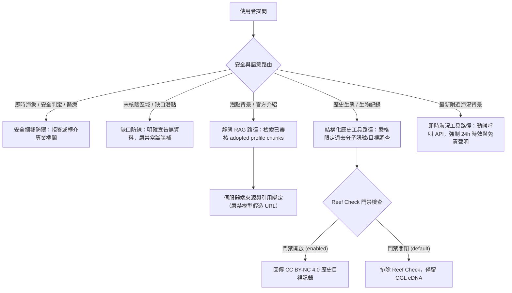

# 地圖 v1 資料資產納入 RAG 回答系統之適用性與契約評估報告

## 1. 目的與評估範疇

本評估報告針對地圖模組 v1 累積之各項資料資產（含正式潛點庫、潛點背景介紹草稿、中央氣象署數值模式預報、歷史生態證據、物種參考圖片及未核驗缺口清冊），系統性定義其納入 RAG（檢索增強生成）知識庫與問答系統時的准入路徑、授權條件、回答事實性邊界與安全路由。

---

## 2. 逐資料來源適用性與授權條件評估

| 資料來源與資產 | 原始維護機關／社群 | 授權條款與權利條件 | RAG 准入路徑決策 | 適用範圍與回答事實性邊界 | 禁止用途與防禦限制 |
| :--- | :--- | :--- | :--- | :--- | :--- |
| **正式潛點代表點庫**<br>(`data/curated/dive_sites.csv`) | 交通部觀光署<br>（觀光資訊標準 V2.1） | 政府資料開放授權條款第 1 版 (OGL 1.0) | **RAG 靜態事實候選** | 可回答潛點官方名稱、行政區（縣市／鄉鎮）、官方登記之景點代表點座標與資料品質評級。 | 嚴禁擴大推論為「下水入口」、「停車點」、「撤退點」或「法定活動邊界」。 |
| **潛點背景介紹草稿**<br>(`dive_site_profiles_draft.json`) | 交通部觀光署、地方風景區管理處 | 依 `dive_site_profile_source_registry.csv` 審核，僅限 `decision=adopted` 且具摘要權限者 | **RAG 靜態 Chunk 候選** | 僅允許引用經審核通過之官方介紹、地理環境特色與活動背景描述。回答必須由伺服器端綁定來源引用。 | 嚴禁推論水深、潮流、潛水難度等級、水下能見度或提供安全推薦。未經許可之非受控維護者文字不得入庫。 |
| **中央氣象署海況模式**<br>(M-B0078-001 波流模式) | 交通部中央氣象署 (CWA) | 政府資料開放授權條款第 1 版 (OGL 1.0) | **即時工具專用<br>(Realtime Tool Only)** | 嚴禁靜態嵌入 RAG 語料或向量庫。若未來問答需要海象，只能透過具時效驗證的即時 API 工具動態查詢，且必須附帶模式點名稱、代碼、距離、發布時間與免責宣告。 | 嚴禁回傳過期超過 24 小時之資料；嚴禁斷言為「現地實測」；嚴禁輸出「適合下水」、「水況良好」等安全結論。 |
| **環境 DNA (eDNA) 調查**<br>(全海域基礎生態調查) | 海洋委員會海洋保育署 (OCA) | 政府資料開放授權條款第 1 版 (OGL 1.0) | **結構化歷史工具路徑<br>(非一般文字 Chunk)** | 可回答「歷史採樣時，該站點水樣中曾檢出該生物之 DNA 分子訊號」，並註明採樣日期與站點距代表點距離。 | 嚴禁推論該生物在現地棲息、存活、或為浮潛／潛水肉眼可見。嚴禁作為「當地必看生物」保證。 |
| **珊瑚礁體檢 (Reef Check)**<br>(水下穿越線目視調查) | 台灣珊瑚礁學會<br>TaiBIF 節點 | **CC BY-NC 4.0**<br>（非商業性使用－相同方式分享） | **伺服器門禁工具路徑<br>(需非商業部署設定)** | 僅限在伺服器端環境變數 `REEFCHECK_LOCAL_NONCOMMERCIAL_RESEARCH_MODE=enabled` 啟用時，回答過往研究調查之無脊椎動物紀錄或硬珊瑚覆蓋度區間。 | 預設關閉；呼叫端不得以 URL 參數繞過；嚴禁用於商業推廣或營利服務。**嚴禁根據體檢紀錄捏造特定硬珊瑚物種清單**。 |
| **物種外觀參考圖片**<br>(受控圖檔與 Manifest) | 各攝影作者<br>(Wikimedia Commons) | CC BY 2.0 / CC BY-SA 4.0 / CC BY 2.5 | **不准入 RAG 知識庫<br>(Not Admitted)** | 僅供前端介面作為物種形態之視覺參考，不做 OCR 或圖說文字化入庫。 | 圖片不得作為潛點現地生物記錄之事實證據。 |
| **未核驗區域與無資料潛點**<br>(全臺 5 點以外區域) | 暫無合格機關開放資料 | 未獲授權或座標基準未釐清 | **顯式資料缺口<br>(Explicit Gap)** | 面對北部、南部、東部（蘭嶼）、澎湖其他海域或金馬之潛點提問，必須明確揭露「目前尚無通過四重核驗之正式潛點資料」。 | **嚴禁模型利用常識編造潛點名稱、下水座標或當地物種清單**。南寮漁港與險礁嶼亦不得編造生物紀錄。 |

---

## 3. RAG 准入路徑與架構決策矩陣



---

## 4. 關鍵回答事實性與授權防禦原則

1. **動態海況不得靜態化**：
   中央氣象署近岸海象預報屬於高度時效性之模式資料，嚴禁轉換為靜態 Markdown chunk 或寫入向量索引（Vector Store）。若回答需要海況脈絡，必須透過即時 Tool 調用 API，確保時間戳與免責宣告完整附掛。
2. **歷史證據不得現況化**：
   eDNA 為水樣游離分子片段，Reef Check 為過往目視紀錄。RAG 回答時必須嚴格使用過去式及限定詞（例如：「根據 2022 年 6 月之水樣環境 DNA 調查...」），絕不可回答「此潛點有線紋刺尾鯛棲息」或「保證可看見克氏雙鋸魚」。
3. **珊瑚覆蓋度不得物種化**：
   目前資料庫中之珊瑚證據僅包含「活珊瑚／硬珊瑚覆蓋度百分比」及景點介紹之概略文字（如「海底珊瑚礁海岸」）。在缺乏受控物種級鑑定紀錄前，**RAG 嚴禁列出任何特定石珊瑚或軟珊瑚之學名與中文物種名錄**。
4. **Reef Check CC BY-NC 門禁一致性**：
   嚴格遵守任務 19 的架構規範，Reef Check 相關內容在 RAG 中同樣受伺服器端環境變數 `REEFCHECK_LOCAL_NONCOMMERCIAL_RESEARCH_MODE=enabled` 門禁管制，不得提供任何讓使用者透過提示詞或參數自行繞過的漏洞。
5. **圖片資料不得文字化入庫**：
   物種參考圖片僅為外觀辨識輔助，圖片檔名、EXIF、OCR 或圖說文字不得直接灌入 RAG 知識庫，防止模型誤將外觀參考圖當作現地實拍證據。
6. **未核驗區域嚴禁幻覺補點**：
   東北角、墾丁、小琉球、蘭嶼等熱門潛點目前均屬官方資料缺口。當使用者詢問此類地點時，RAG 必須依據合約輸出固定格式之缺口揭露聲明，嚴格禁止利用大模型常識編造經緯度或下水點。

---

## 5. 安全路由攔截規則表

| 意圖類別 | 觸發語義特徵 | 攔截與處理策略 | 輸出行為 |
| :--- | :--- | :--- | :--- |
| **即時下水安全判定** | 「今天能潛水嗎」、「浪況好不好」、「會不會危險」、「水況適合初學者嗎」 | **拒絕安全保證**，導引至氣象署與現場評估 | 明確聲明系統不提供安全與下水判定，請查閱中央氣象署最新海象警特報，並由現場合格專業教練評估。 |
| **醫療與緊急處置** | 「被魔鬼海星刺到怎麼辦」、「減壓病急救」、「溺水」、「肺氣壓傷」 | **醫療急救轉介** | 嚴格拒絕提供診斷，提供海巡 118、消防 119 與高壓氧治療責任醫院聯繫方式。 |
| **下水點與路線導引** | 「最佳下水點在哪」、「停車後怎麼走下海」、「推薦切入點」 | **代表點免責聲明** | 聲明現有座標僅為景點代表點，不代表下水入口、活動範圍或通道；嚴禁自行依座標貿然入水。 |
```
